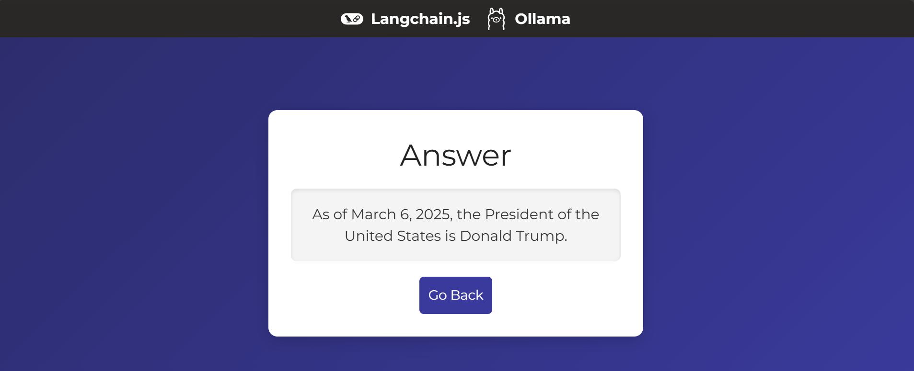
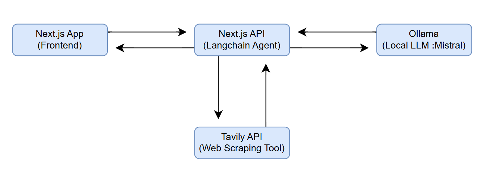

# Full Stack Developer Challenge - Next.js & LangChain.js

## Explainer Video
- [Youtube](https://youtu.be/OYTd07YO5ek)

## Preview





## Project Description

This project is a full-stack application built with **Next.js** and **LangChain.js**. It allows users to submit queries and receive responses generated by a LangChain.js agent that uses a web search tool and a local language model (LLM) powered by **Ollama**.

The system consists of:
1. A form page in Next.js where users can input their queries.
2. A Next.js API route that triggers a LangChain.js agent.
3. A results page where users can view the generated response.

## System Diagram



## System Requirements

- **Frontend**: A Next.js page with a form for submitting queries.
- **Backend**: A Next.js API route that:
  - Uses a web search tool from LangChain.js.
  - Executes a local language model (LLM) via Ollama.
  - Returns a response based on the user's query.
- **Results**: A Next.js page that displays the generated response.

## How to Run the Project Locally

1. **Clone the Repository**:
   ```bash
   git clone https://github.com/your-username/challenge.git
   ```

2. **Install Dependencies**:
   ```bash
   npm install
   ```

3. **Set Up Environment Variables**:
   Create a `.env.local` file in the root of the project and add the following variables:
   ```env
   TAVILY_API_KEY=your_tavily_api_key
   ```
   API key is required to use the Tavily APIs. All Tavily endpoints require authentication via API keys. You can obtain a free API key by registering on their website.

4. **Run Ollama**:
   [Download Ollama](https://ollama.com/download) and install it locally.  
   ```bash
   ollama run mistral
   ``` 
   Run to download and install the model locally (Requires 4.1GB and 8GB of RAM)
   Open http://localhost:11434 to check if Ollama is running.


5. **Start the Application**:
   ```bash
   npm run dev
   ```

6. **Access the Application**:
   Open your browser and navigate to `http://localhost:3000`.

## Tools and LLM Integration

### Web Search Tool
- **Tavily Search**: Used to perform web searches and retrieve up-to-date information.

### Local Language Model (LLM)
- **Ollama**: Used to run a local language model and generate responses based on search results.

## Considerations
   This project, while functional, has significant areas for improvement that should be addressed to optimize its performance and accuracy. Below are some key aspects that could be enhanced:
   - Inconsistent Use of Tools.
   - Accuracy of Responses.
   - Optimization of the Search Process.
   - Context and Memory Management.
   - Scalability and Robustness.

## Sources

- [Next.js Documentation](https://nextjs.org/)
- [LangChain.js Documentation](https://www.langchain.com/)
- [Langchain + Ollama](https://js.langchain.com/docs/integrations/llms/ollama/)
- [Ollama Documentation](https://ollama.com/)
- [Tavily API Documentation](https://tavily.com/)
- [Youtube](https://www.youtube.com/@leonvanzyl)
- [ChatGPT](https://chatgpt.com/)

### Diferents Repositories
- (https://github.com/brunnolou/next-ollama-app)
- (https://github.com/langchain-ai/langchain-nextjs-template)
- (https://github.com/langchain-ai/ollama-deep-researcher)


